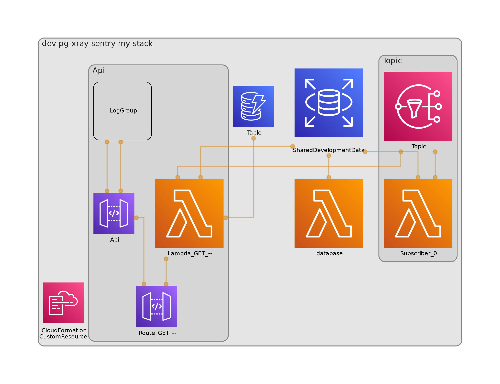
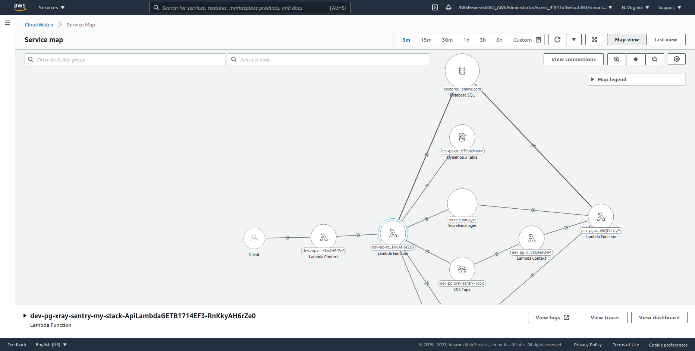

# Knex with Sentry and Postgres

## Tools

- SST to make the infrastructure
- Knex to manage migrations for postgresql
- cdk-dia to produce diagrams
- Sentry to monitor errors
- XRay to perform tracing

## Objective

- Demonstrate a knex deployment with knexfile; in typescript.
- Apply all observability layers.




## Outcome

- Able to capture all errors in sentry without capturing any PII
- Able to show xray and trace propagation across system via SNS



## Todo

Complete hook to transpile migrations before deploying:

```bash
tsc src/knex/migrations/*.ts --outDir migrations
```

Or, programmatically from the typescript compiler: https://github.com/Microsoft/TypeScript/wiki/Using-the-Compiler-API
